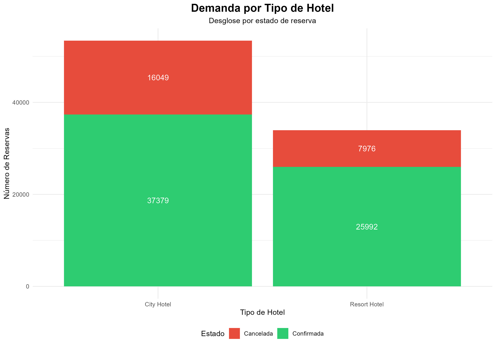
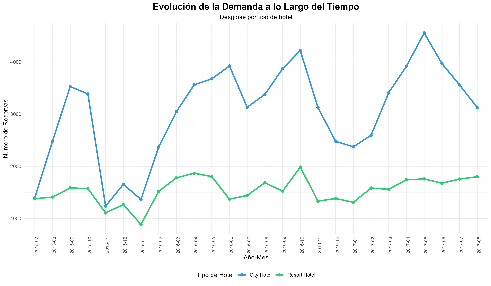
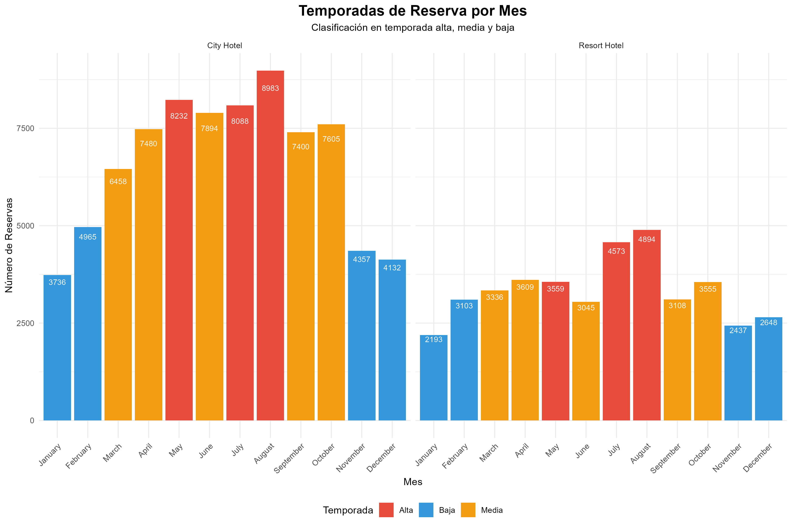
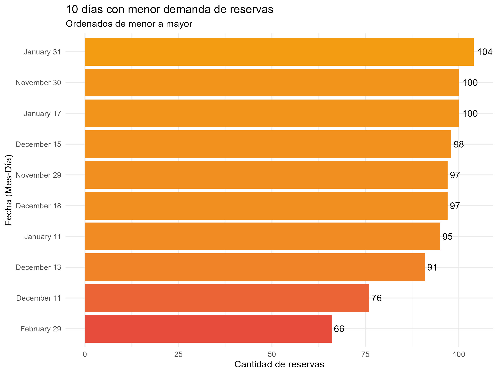
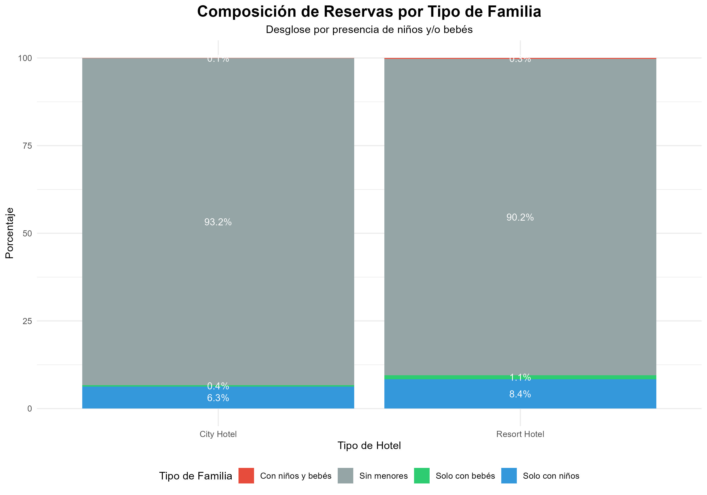
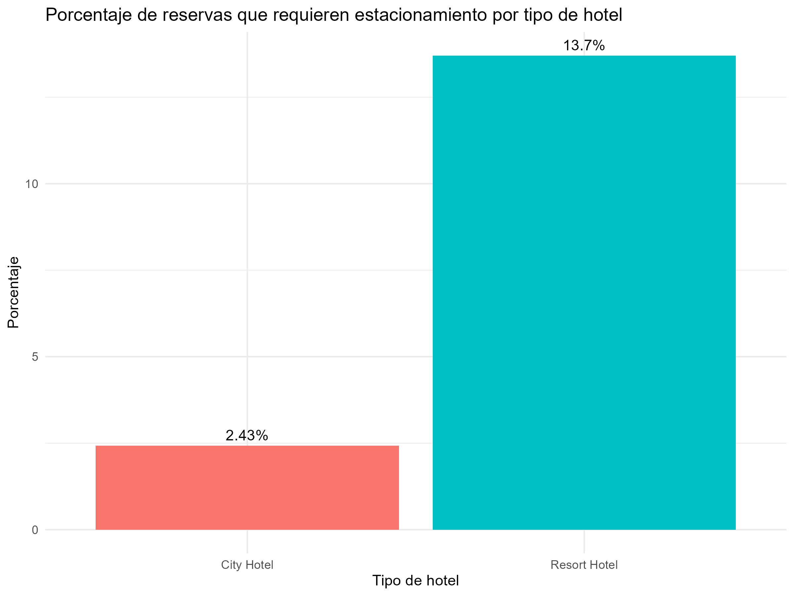
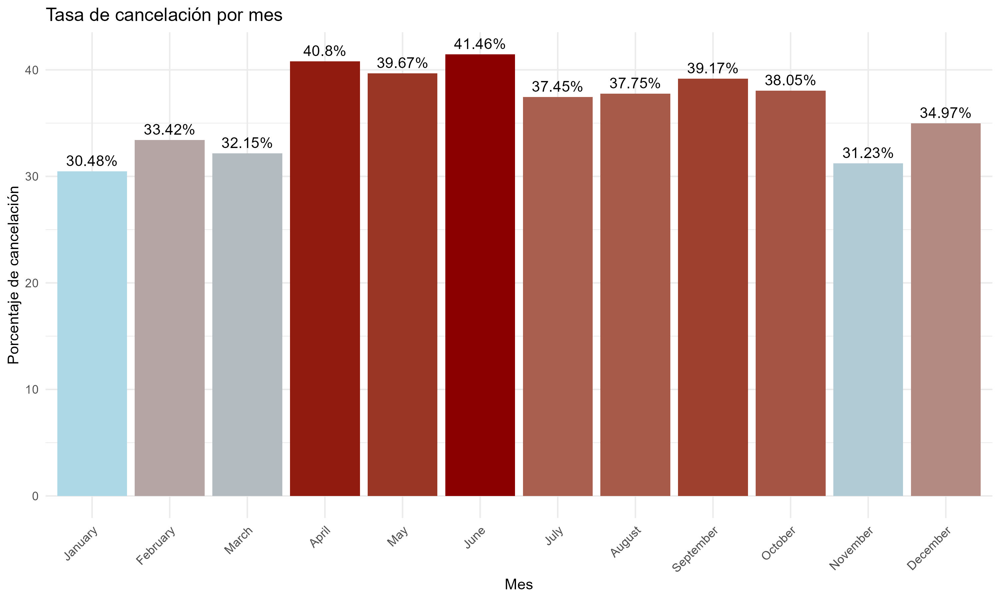
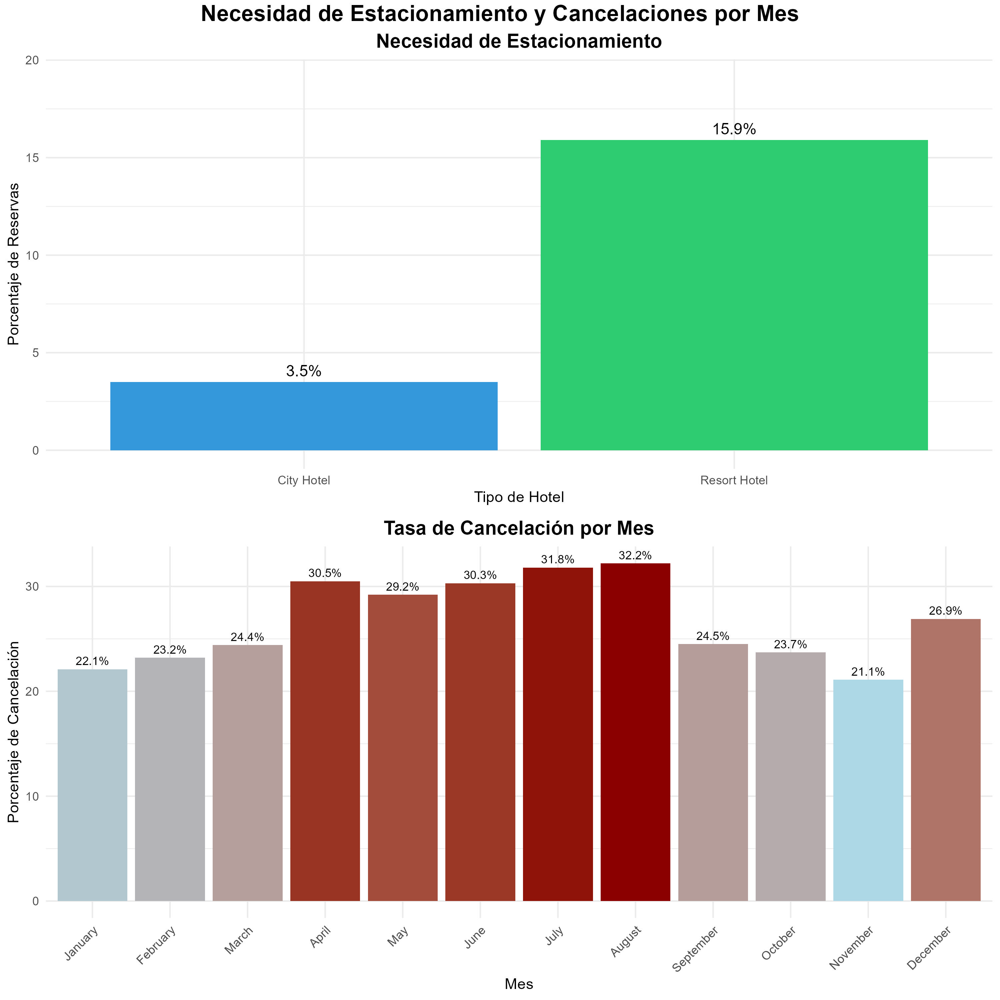
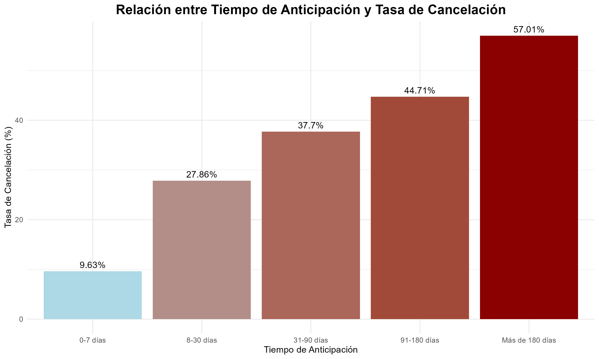

# CC216-TP-2025-1

# Hotel Booking Demand Analysis


## Resumen Ejecutivo

Este repositorio contiene un análisis exploratorio de datos (EDA) del conjunto de datos "Hotel booking demand", realizado como parte del trabajo TB1 para el curso CC216 - Fundamentos de Data Science de la Universidad Peruana de Ciencias Aplicadas (UPC). El análisis examina patrones de reserva en dos tipos de hoteles portugueses (urbano y resort) durante un período de dos años, identificando tendencias estacionales, comportamientos de cancelación, preferencias de clientes y oportunidades de optimización operativa.

Nuestros hallazgos revelan marcadas diferencias entre el comportamiento de los clientes según el tipo de hotel, con patrones claros de estacionalidad, correlación entre tiempo de anticipación y tasas de cancelación, y segmentación de clientela. Las recomendaciones estratégicas derivadas del análisis pueden ayudar a mejorar la rentabilidad, optimizar la gestión de demanda y refinar las políticas operativas de los establecimientos.

## Integrantes del Grupo

| Código      | Nombres y apellidos           | Responsabilidades principales |
|-------------|-------------------------------|-------------------------------|
| u202118038  | Conza Hualpa, Alexia Evelyn   | Metodología EDA, recomendaciones estratégicas |
| u202311894  | Villanueva Aramburú, José Javier | Análisis de tendencias temporales, visualizaciones |
| u20231e122  | Bravo Lévano, Eduardo Fernando | Preprocesamiento de datos, detección de outliers |
| u202412543  | Caldas Zapata, Ernesto Yago   | Segmentación de clientes, análisis de cancelaciones  |

## Contexto del Proyecto

### Origen de los Datos

El conjunto de datos "Hotel booking demand" procede de una publicación académica titulada "Hotel booking demand datasets", elaborada por los investigadores Nuno Antonio, Ana de Almeida y Luis Nunes. Este trabajo fue publicado en la revista científica *Data in Brief*, Volumen 22, en febrero de 2019 (páginas 41-49). La publicación tiene el DOI: [https://doi.org/10.1016/j.dib.2018.11.126](https://doi.org/10.1016/j.dib.2018.11.126) y estuvo disponible en línea desde el 29 de noviembre de 2018.

Los datos corresponden a reservas efectuadas en dos hoteles localizados en Portugal:
1. **Resort Hotel (H1)**: Situado en la región turística del Algarve
2. **City Hotel (H2)**: Ubicado en la capital, Lisboa

El período temporal cubierto por las observaciones se extiende desde el 1 de julio de 2015 hasta el 31 de agosto de 2017. Los datos fueron extraídos directamente de los Sistemas de Gestión de Propiedades (PMS) de ambos hoteles, lo que garantiza que se trata de registros administrativos y operacionales reales, no de datos simulados o recopilados mediante encuestas.

Para esta evaluación académica, el conjunto de datos original fue modificado intencionalmente por la coordinación del curso, introduciendo "ruido" controlado en forma de valores faltantes (NA) y valores atípicos (outliers), con el objetivo de permitir la aplicación y evaluación de técnicas de limpieza y preparación de datos.

### Relevancia y Aplicaciones

Este análisis resulta particularmente relevante para diversos actores del sector turístico y hotelero:

1. **Establecimientos hoteleros**: Para optimizar tasas de ocupación, establecer políticas de precios dinámicos y reducir cancelaciones.

2. **Agencias de viajes y operadores turísticos**: Para predecir patrones de demanda y adaptar sus ofertas según temporadas.

3. **Departamentos de marketing**: Para segmentar campañas según estacionalidad y perfiles de cliente.

4. **Gestores hoteleros**: Para fundamentar decisiones estratégicas basadas en datos históricos.

5. **Plataformas de reserva online**: Para optimizar algoritmos de recomendación y políticas de precios.

## Descripción del Dataset

### Estructura General

El dataset contiene 87,396 observaciones (después de eliminar duplicados) con 32 variables que documentan diversos aspectos de las reservas hoteleras. Los datos han sido anonimizados para proteger tanto la identidad de los clientes como detalles específicos de los hoteles más allá de su tipo y ubicación general.

```R
# Carga de datos
CSV_original <- file.path(data_dir, "hotel_bookings.csv")
hotel_data <- read.csv(CSV_original, header = TRUE, stringsAsFactors = FALSE)
hotel_data <- unique(hotel_data)  # Eliminar duplicados

# Dimensiones del conjunto de datos
dim(hotel_data)
```

```
[1] 87396    32
```

### Variables y Descripción

| Variable | Tipo | Descripción |
|----------|------|-------------|
| hotel | Categórico | Tipo de hotel: "Resort Hotel" o "City Hotel" |
| is_canceled | Booleano | Indica si la reserva fue cancelada (1) o no (0) |
| lead_time | Numérico | Número de días entre la reserva y la fecha de llegada |
| arrival_date_year | Numérico | Año de llegada (2015-2017) |
| arrival_date_month | Categórico | Mes de llegada (January-December) |
| arrival_date_week_number | Numérico | Número de semana del año en que llega el huésped |
| arrival_date_day_of_month | Numérico | Día del mes en que llega el huésped |
| stays_in_weekend_nights | Numérico | Número de noches durante fines de semana |
| stays_in_week_nights | Numérico | Número de noches durante días de semana |
| adults | Numérico | Número de adultos incluidos en la reserva |
| children | Numérico | Número de niños incluidos en la reserva |
| babies | Numérico | Número de bebés incluidos en la reserva |
| meal | Categórico | Tipo de comida: BB (Bed & Breakfast), HB (Half Board), FB (Full Board), etc. |
| country | Categórico | Código del país de origen del cliente (ej. PRT para Portugal) |
| market_segment | Categórico | Segmento de mercado (Direct, Corporate, Online TA, etc.) |
| distribution_channel | Categórico | Canal de distribución de la reserva |
| is_repeated_guest | Booleano | Indica si el huésped ya ha estado antes en el hotel (1) o no (0) |
| previous_cancellations | Numérico | Número de reservas anteriores canceladas por el cliente |
| previous_bookings_not_canceled | Numérico | Número de reservas anteriores no canceladas por el cliente |
| reserved_room_type | Categórico | Tipo de habitación reservada (A, B, C, etc.) |
| assigned_room_type | Categórico | Tipo de habitación asignada (puede diferir de la reservada) |
| booking_changes | Numérico | Número de cambios realizados a la reserva |
| deposit_type | Categórico | Tipo de depósito (No Deposit, Non Refund, Refundable) |
| agent | Categórico | ID del agente que hizo la reserva |
| company | Categórico | ID de la empresa que hizo la reserva |
| days_in_waiting_list | Numérico | Días que la reserva estuvo en lista de espera |
| customer_type | Categórico | Tipo de cliente (Transient, Contract, Group, etc.) |
| adr | Numérico | Tarifa diaria promedio (Average Daily Rate) por habitación reservada |
| required_car_parking_spaces | Numérico | Número de espacios de estacionamiento requeridos |
| total_of_special_requests | Numérico | Número total de solicitudes especiales del cliente |
| reservation_status | Categórico | Estado final de la reserva (Check-Out, Canceled, No-Show) |
| reservation_status_date | Fecha | Fecha del último estado de la reserva |

```R
# Análisis de la estructura de los datos
str(hotel_data)
```

```
'data.frame':   87396 obs. of  32 variables:
 $ hotel                         : chr  "Resort Hotel" "Resort Hotel" "Resort Hotel" "Resort Hotel" ...
 $ is_canceled                   : int  0 0 0 0 0 0 0 1 1 1 ...
 $ lead_time                     : int  342 737 7 13 14 0 9 85 75 23 ...
 $ arrival_date_year             : int  2015 2015 2015 2015 2015 2015 2015 2015 2015 2015 ...
 $ arrival_date_month            : chr  "July" "July" "July" "July" ...
 $ arrival_date_week_number      : int  27 27 27 27 27 27 27 27 27 27 ...
 $ arrival_date_day_of_month     : int  1 1 1 1 1 1 1 1 1 1 ...
 $ stays_in_weekend_nights       : int  0 0 0 0 0 0 0 0 0 0 ...
 $ stays_in_week_nights          : int  0 0 1 1 2 2 2 3 3 4 ...
 $ adults                        : int  2 2 1 1 2 2 2 2 2 2 ...
 $ children                      : int  0 0 0 0 0 0 0 0 0 0 ...
 $ babies                        : int  0 0 0 0 0 0 0 0 0 0 ...
 $ meal                          : chr  "BB" "BB" "BB" "BB" ...
 $ country                       : chr  "PRT" "PRT" "GBR" "GBR" ...
 $ market_segment                : chr  "Direct" "Direct" "Direct" "Corporate" ...
 $ distribution_channel          : chr  "Direct" "Direct" "Direct" "Corporate" ...
 $ is_repeated_guest             : int  0 0 0 0 0 0 0 0 0 0 ...
 $ previous_cancellations        : int  0 0 0 0 0 0 0 0 0 0 ...
 $ previous_bookings_not_canceled: int  0 0 0 0 0 0 0 0 0 0 ...
 $ reserved_room_type            : chr  "C" "C" "A" "A" ...
 $ assigned_room_type            : chr  "C" "C" "C" "A" ...
 $ booking_changes               : int  3 4 0 0 0 0 0 0 0 0 ...
 $ deposit_type                  : chr  "No Deposit" "No Deposit" "No Deposit" "No Deposit" ...
 $ agent                         : chr  "NULL" "NULL" "NULL" "304" ...
 $ company                       : chr  "NULL" "NULL" "NULL" "NULL" ...
 $ days_in_waiting_list          : int  0 0 0 0 0 0 0 0 0 0 ...
 $ customer_type                 : chr  "Transient" "Transient" "Transient" "Transient" ...
 $ adr                           : num  0 0 75 75 98 ...
 $ required_car_parking_spaces   : int  0 0 0 0 0 0 0 0 0 0 ...
 $ total_of_special_requests     : int  0 0 0 0 1 0 1 1 0 0 ...
 $ reservation_status            : chr  "Check-Out" "Check-Out" "Check-Out" "Check-Out" ...
 $ reservation_status_date       : chr  "2015-07-01" "2015-07-01" "2015-07-02" "2015-07-02" ...
```

### Variables Derivadas (Generadas durante el análisis)

Durante nuestro análisis, creamos las siguientes variables derivadas para facilitar ciertos aspectos del análisis:

| Variable Derivada | Tipo | Descripción |
|-------------------|------|-------------|
| total_nights | Numérico | Suma total de noches (stays_in_weekend_nights + stays_in_week_nights) |
| tipo_familia | Categórico | Clasificación según composición familiar ("Sin menores", "Solo con niños", "Solo con bebés", "Con niños y bebés") |
| lead_time_categoria | Categórico | Categorización del tiempo de anticipación ("0-7 días", "8-30 días", "31-90 días", "91-180 días", "Más de 180 días") |
| Temporada | Categórico | Clasificación de la temporada según volumen de reservas ("Alta", "Media", "Baja") |

```R
# Creación de variables derivadas
hotel_data_final$total_nights <- hotel_data_final$stays_in_weekend_nights + hotel_data_final$stays_in_week_nights

# Clasificación por tipo de familia
hotel_data_final$tipo_familia <- case_when(
  hotel_data_final$children > 0 & hotel_data_final$babies > 0 ~ "Con niños y bebés",
  hotel_data_final$children > 0 ~ "Solo con niños",
  hotel_data_final$babies > 0 ~ "Solo con bebés",
  TRUE ~ "Sin menores"
)

# Clasificación por tiempo de anticipación
hotel_data_final$lead_time_categoria <- cut(hotel_data_final$lead_time, 
                                           breaks = c(-1, 7, 30, 90, 180, Inf),
                                           labels = c("0-7 días", "8-30 días", "31-90 días", "91-180 días", "Más de 180 días"))

# Visualización de la estructura final
str(hotel_data_final[, c("hotel", "is_canceled", "lead_time", 
                         "lead_time_categoria", "arrival_date_month", 
                         "Temporada", "total_nights", "tipo_familia")])
```

```
'data.frame':	87396 obs. of  8 variables:
 $ hotel              : chr  "Resort Hotel" "Resort Hotel" "Resort Hotel" "Resort Hotel" ...
 $ is_canceled        : int  0 0 0 0 0 0 0 1 1 1 ...
 $ lead_time          : int  342 365 7 13 14 0 9 85 75 23 ...
 $ lead_time_categoria: Factor w/ 5 levels "0-7 días","8-30 días",..: 5 5 1 2 2 1 2 3 3 2 ...
 $ arrival_date_month : Factor w/ 12 levels "January","February",..: 7 7 7 7 7 7 7 7 7 7 ...
 $ Temporada          : chr  "Alta" "Alta" "Alta" "Alta" ...
 $ total_nights       : int  1 1 1 1 2 2 2 3 3 4 ...
 $ tipo_familia       : chr  "Sin menores" "Sin menores" "Sin menores" "Sin menores" ...
```

## Metodología

### Enfoque de Análisis

Nuestro análisis exploratorio de datos (EDA) siguió un enfoque sistemático que incluyó las siguientes fases:

1. **Carga e inspección inicial de datos**
2. **Análisis de valores faltantes y atípicos**
3. **Limpieza y transformación de datos**
4. **Análisis univariante y multivariante**
5. **Visualización de patrones y tendencias**
6. **Formulación de conclusiones y recomendaciones**

### Herramientas y Tecnologías

Para realizar este análisis utilizamos:

- **R/RStudio**: Como entorno principal de análisis y programación
- **Tidyverse**: Conjunto de paquetes para manipulación y visualización de datos
- **ggplot2**: Para la creación de visualizaciones estáticas 
- **skimr**: Para resúmenes estadísticos básicos
- **naniar**: Para análisis de datos faltantes
- **gridExtra**: Para combinar múltiples visualizaciones

```R
# Carga de librerías utilizadas
library(tidyverse)
library(naniar)
library(skimr)
library(knitr)
library(crayon)
library(ggplot2)
library(gridExtra)
```

### Preprocesamiento de Datos

#### Identificación y Tratamiento de Datos Faltantes

Se detectaron valores NA únicamente en la variable `children` (4 registros, 0.005% del total). Dado que la gran mayoría de las reservas (90.43%) no incluían niños, se optó por imputar estos valores faltantes con la moda (0). Esta decisión se basó en la distribución estadística observada y en la conveniencia de mantener la integridad del conjunto de datos sin eliminar registros.

```R
# Análisis de valores faltantes
na_count <- colSums(is.na(hotel_data))
na_percentage <- round(na_count / nrow(hotel_data) * 100, 2)

na_summary <- data.frame(
  Variable = names(na_count),
  NA_Count = na_count,
  NA_Percentage = na_percentage
)

# Ordenar por cantidad de NA (descendente)
na_summary <- na_summary[order(-na_summary$NA_Count), ]
print(na_summary)

# Análisis específico para variable 'children'
print(table(hotel_data$children, useNA = "ifany"))

# Imputación de valores faltantes
hotel_data_limpio$children[is.na(hotel_data_limpio$children)] <- 0
```

```
                                                     Variable NA_Count NA_Percentage
children                                             children        4             0
hotel                                                   hotel        0             0
is_canceled                                       is_canceled        0             0
lead_time                                           lead_time        0             0
arrival_date_year                           arrival_date_year        0             0
...

Distribución de valores no-NA en 'children':
    0     1     2     3    10  <NA> 
79028  4695  3593    75     1     4 

Valores NA en 'children' después de imputación: 0 
```

#### Identificación y Tratamiento de Datos Atípicos

Utilizando el método del rango intercuartílico (IQR), identificamos valores atípicos significativos en varias variables numéricas:

```R
# Análisis estadístico de outliers usando el método IQR
outlier_stats <- function(data, var_name) {
  var <- data[[var_name]]
  var <- var[!is.na(var)]
  
  Q1 <- quantile(var, 0.25)
  Q3 <- quantile(var, 0.75)
  IQR <- Q3 - Q1
  
  lower_bound <- Q1 - 1.5 * IQR
  upper_bound <- Q3 + 1.5 * IQR
  
  outliers <- sum(var < lower_bound | var > upper_bound)
  outlier_percent <- round(outliers / length(var) * 100, 2)
  
  return(data.frame(
    Variable = var_name,
    Q1 = Q1,
    Q3 = Q3,
    IQR = IQR,
    Lower_Bound = lower_bound,
    Upper_Bound = upper_bound,
    Outlier_Count = outliers,
    Outlier_Percentage = outlier_percent
  ))
}

# Variables numéricas que pueden tener outliers
numeric_vars <- c(
  "lead_time", "stays_in_weekend_nights", "stays_in_week_nights",
  "adults", "children", "babies", "previous_cancellations",
  "previous_bookings_not_canceled", "booking_changes", 
  "days_in_waiting_list", "adr", "required_car_parking_spaces",
  "total_of_special_requests"
)

outlier_summary <- do.call(rbind, lapply(numeric_vars, function(var) {
  outlier_stats(hotel_data, var)
}))

print(outlier_summary)
```

```
                            Variable Q1  Q3 IQR Lower_Bound Upper_Bound Outlier_Count Outlier_Percentage
25%                        lead_time 11 125 114      -160.0       296.0          2396               2.74
25%1         stays_in_weekend_nights  0   2   2        -3.0         5.0           220               0.25
25%2            stays_in_week_nights  1   4   3        -3.5         8.5          1531               1.75
25%3                          adults  2   2   0         2.0         2.0         22899              26.20
25%4                        children  0   0   0         0.0         0.0          8364               9.57
25%5                          babies  0   0   0         0.0         0.0           914               1.05
25%6          previous_cancellations  0   0   0         0.0         0.0          1685               1.93
25%7  previous_bookings_not_canceled  0   0   0         0.0         0.0          3545               4.06
25%8                 booking_changes  0   0   0         0.0         0.0         15902              18.20
25%9            days_in_waiting_list  0   0   0         0.0         0.0           860               0.98
25%10                            adr 72 134  62       -21.0       227.0          2490               2.85
25%11    required_car_parking_spaces  0   0   0         0.0         0.0          7313               8.37
25%12      total_of_special_requests  0   1   1        -1.5         2.5          2673               3.06
```

Optamos por la técnica de winsorización (reemplazo de valores extremos por los valores en los límites establecidos) como estrategia principal para el tratamiento de outliers:

```R
# Función para aplicar winsorización en una variable
winsorizar <- function(x, lower_limit, upper_limit) {
  x[x < lower_limit] <- lower_limit
  x[x > upper_limit] <- upper_limit
  return(x)
}

# Aplicación de winsorización a las principales variables
# lead_time
hotel_data_limpio$lead_time <- winsorizar(hotel_data_limpio$lead_time, 0, 365)

# adults
hotel_data_limpio$adults[hotel_data_limpio$adults == 0] <- 1
hotel_data_limpio$adults <- winsorizar(hotel_data_limpio$adults, 1, 4)

# stays_in_weekend_nights y stays_in_week_nights
hotel_data_limpio$stays_in_weekend_nights <- winsorizar(hotel_data_limpio$stays_in_weekend_nights, 0, 14)
hotel_data_limpio$stays_in_week_nights <- winsorizar(hotel_data_limpio$stays_in_week_nights, 0, 14)

# adr (tarifa diaria promedio)
hotel_data_limpio$adr[hotel_data_limpio$adr < 0] <- 0
hotel_data_limpio$adr <- winsorizar(hotel_data_limpio$adr, 0, 1000)

# children y babies
hotel_data_limpio$children <- winsorizar(hotel_data_limpio$children, 0, 3)
hotel_data_limpio$babies <- winsorizar(hotel_data_limpio$babies, 0, 2)
```

```
Tratamiento de 'lead_time':
  Antes - Max: 737 Min: 0
  Después - Max: 365 Min: 0 

Tratamiento de 'adults':
  Antes - Max: 55 Min: 0
  Después - Max: 4 Min: 1 

Tratamiento de 'stays_in_weekend_nights':
  Antes - Max: 19
  Después - Max: 14 

Tratamiento de 'stays_in_week_nights':
  Antes - Max: 50
  Después - Max: 14 

Tratamiento de 'adr':
  Antes - Max: 5400 Min: -6.38
  Después - Max: 1000 Min: 0 

Tratamiento de 'children':
  Después - Max: 3 

Tratamiento de 'babies':
  Después - Max: 2 
```

#### Corrección de Inconsistencias Lógicas

Se identificaron y corrigieron las siguientes inconsistencias lógicas:

```R
# Identificar reservas sin noches (estancia de 0 días)
reservas_sin_noches <- hotel_data_limpio$stays_in_weekend_nights == 0 & 
  hotel_data_limpio$stays_in_week_nights == 0

cat("Reservas con estancia de 0 días:", sum(reservas_sin_noches), "\n")

# Como no tiene sentido una reserva sin estadía, establecemos al menos 1 noche
hotel_data_limpio$stays_in_week_nights[reservas_sin_noches] <- 1
cat("Reservas con estancia de 0 días después de corrección:", 
    sum(hotel_data_limpio$stays_in_weekend_nights == 0 & 
          hotel_data_limpio$stays_in_week_nights == 0), "\n")
```

```
Reservas sin adultos: 385 
Reservas sin noches (0 días de estadía): 651 
Reservas sin noches (0 días de estadía) después de corrección: 0 
```

## Análisis Exploratorio y Hallazgos

### 1. Distribución de Reservas por Tipo de Hotel
¿Cuántas reservas se realizan por tipo de hotel?


```R
# Contar reservas por tipo de hotel
reservas_por_hotel <- table(hotel_data_limpio$hotel)
reservas_por_hotel_df <- as.data.frame(reservas_por_hotel)
names(reservas_por_hotel_df) <- c("Tipo_Hotel", "Cantidad")

# Calcular porcentajes
reservas_por_hotel_df$Porcentaje <- round(
  reservas_por_hotel_df$Cantidad / sum(reservas_por_hotel_df$Cantidad) * 100, 2
)

print(reservas_por_hotel_df)

# Análisis por estado de cancelación para ver preferencia real
reservas_completadas <- hotel_data_limpio[hotel_data_limpio$is_canceled == 0, ]
reservas_completadas_por_hotel <- table(reservas_completadas$hotel)
reservas_completadas_df <- as.data.frame(reservas_completadas_por_hotel)
names(reservas_completadas_df) <- c("Tipo_Hotel", "Reservas_Completadas")

# Calcular porcentajes de reservas completadas
reservas_completadas_df$Porcentaje <- round(
  reservas_completadas_df$Reservas_Completadas / sum(reservas_completadas_df$Reservas_Completadas) * 100, 2
)

print(reservas_completadas_df)
```

```
    Tipo_Hotel Cantidad Porcentaje
1   City Hotel    53428      61.13
2 Resort Hotel    33968      38.87

    Tipo_Hotel Reservas_Completadas Porcentaje
1   City Hotel                37379      58.98
2 Resort Hotel                25992      41.02
```

El City Hotel representa claramente la mayoría de las reservas, con un **61.13%** del total (53,428 reservas), mientras que el Resort Hotel cuenta con el **38.87%** restante (33,968 reservas). Esta diferencia puede atribuirse a la ubicación urbana del primer hotel, lo que típicamente implica mayor rotación de clientes y estancias más cortas.

En cuanto a las reservas que efectivamente se completaron (no canceladas), la proporción se mantiene similar, con un **58.98%** para el City Hotel frente a un **41.02%** para el Resort Hotel.

**Hallazgo clave**: Aunque el City Hotel genera más reservas, también exhibe una tasa de cancelación significativamente mayor (30.04%) en comparación con el Resort Hotel (23.48%), lo que sugiere diferencias importantes en el comportamiento del cliente según el tipo de alojamiento.

### 2. Evolución de la Demanda a lo Largo del Tiempo
¿Está aumentando la demanda con el tiempo?

```R
# Análisis por año con porcentajes
reservas_por_anio <- hotel_data_limpio %>%
  group_by(arrival_date_year) %>%
  summarise(
    Total_Reservas = n(),
    Reservas_Completadas = sum(is_canceled == 0),
    Reservas_Canceladas = sum(is_canceled == 1)
  ) %>%
  mutate(
    Porcentaje_Completadas = round(Reservas_Completadas / Total_Reservas * 100, 1),
    Porcentaje_Canceladas = round(Reservas_Canceladas / Total_Reservas * 100, 1)
  )

print(reservas_por_anio)
```

```
# A tibble: 3 × 6
  arrival_date_year Total_Reservas Reservas_Completadas Reservas_Canceladas Porcentaje_Completadas Porcentaje_Canceladas
              <int>          <int>                <int>               <int>                  <dbl>                 <dbl>
1              2015          13313                10609                2704                   79.7                  20.3
2              2016          42391                31183               11208                   73.6                  26.4
3              2017          31692                21579               10113                   68.1                  31.9
```

La evolución anual muestra patrones significativos:

| Año | Total Reservas | Reservas Completadas | % Completadas | % Canceladas |
|-----|----------------|----------------------|---------------|--------------|
| 2015 | 13,313 | 10,609 | 79.7% | 20.3% |
| 2016 | 42,391 | 31,183 | 73.6% | 26.4% |
| 2017 | 31,692 | 21,579 | 68.1% | 31.9% |

**Hallazgo clave**: Se observa una tendencia preocupante de aumento en la tasa de cancelación año tras año, pasando del 20.3% en 2015 al 31.9% en 2017, lo que representa un incremento del 57.1% en la proporción de reservas canceladas durante el período estudiado.

### 3. Identificación de Temporadas de Reserva
¿Cuáles son las temporadas de reservas?


```R
# Agregación por mes
reservas_por_mes <- hotel_data_limpio %>%
  group_by(arrival_date_month) %>%
  summarise(
    Total_Reservas = n(),
    Reservas_Completadas = sum(is_canceled == 0),
    Tasa_Cancelacion = round(sum(is_canceled) / n() * 100, 2)
  ) %>%
  arrange(match(arrival_date_month, c("January", "February", "March", "April", "May", "June", 
                                    "July", "August", "September", "October", "November", "December")))

print(reservas_por_mes)

# Determinar temporadas basadas en cantidad de reservas
media_reservas <- mean(reservas_por_mes$Total_Reservas)
sd_reservas <- sd(reservas_por_mes$Total_Reservas)

reservas_por_mes$Temporada <- case_when(
  reservas_por_mes$Total_Reservas >= (media_reservas + 0.5 * sd_reservas) ~ "Alta",
  reservas_por_mes$Total_Reservas <= (media_reservas - 0.5 * sd_reservas) ~ "Baja",
  TRUE ~ "Media"
)

print(reservas_por_mes[, c("arrival_date_month", "Total_Reservas", "Temporada")])
```

```
# A tibble: 12 × 4
   arrival_date_month Total_Reservas Reservas_Completadas Tasa_Cancelacion
   <fct>                       <int>                <int>            <dbl>
 1 January                      4693                 3655             22.1
 2 February                     6098                 4683             23.2
 3 March                        7513                 5683             24.4
 4 April                        7908                 5499             30.5
 5 May                          8355                 5913             29.2
 6 June                         7765                 5411             30.3
 7 July                        10057                 6859             31.8
 8 August                      11257                 7634             32.2
 9 September                    6690                 5048             24.5
10 October                      6934                 5292             23.7
11 November                     4995                 3941             21.1
12 December                     5131                 3753             26.9

# A tibble: 12 × 3
   arrival_date_month Total_Reservas Temporada
   <fct>                       <int> <chr>    
 1 January                      4693 Baja     
 2 February                     6098 Baja     
 3 March                        7513 Media    
 4 April                        7908 Media    
 5 May                          8355 Alta     
 6 June                         7765 Media    
 7 July                        10057 Alta     
 8 August                      11257 Alta     
 9 September                    6690 Media    
10 October                      6934 Media    
11 November                     4995 Baja     
12 December                     5131 Baja     
```

Basándonos en el volumen mensual de reservas, hemos identificado tres temporadas claramente diferenciadas:

| Temporada | Meses | Promedio de Reservas Mensuales |
|-----------|-------|--------------------------------|
| Alta | Mayo, Julio, Agosto | 9,890 |
| Media | Marzo, Abril, Junio, Septiembre, Octubre | 7,362 |
| Baja | Enero, Febrero, Noviembre, Diciembre | 5,204 |

El mes con mayor demanda es **agosto** con 11,257 reservas, mientras que el mes con menor demanda es **enero** con apenas 4,693 reservas.

### 4. Análisis de Días con Menor Demanda
¿Cuándo es menor la demanda de reservas?


```R
# Análisis por combinación de mes y día del mes
reservas_por_dia_mes <- hotel_data_limpio %>%
  group_by(arrival_date_month, arrival_date_day_of_month) %>%
  summarise(Total_Reservas = n()) %>%
  arrange(Total_Reservas)

print(head(reservas_por_dia_mes, 10))
```

```
# A tibble: 10 × 3
# Groups:   arrival_date_month [4]
   arrival_date_month arrival_date_day_of_month Total_Reservas
   <fct>                                  <int>          <int>
 1 February                                  29             66
 2 December                                  11             76
 3 December                                  13             91
 4 January                                   11             95
 5 November                                  29             97
 6 December                                  18             97
 7 December                                  15             98
 8 January                                   17            100
 9 November                                  30            100
10 January                                   31            104
```

El análisis  por día del mes revela que las combinaciones específicas de mes y día con menor demanda se concentran en los meses de temporada baja (diciembre, enero, febrero).

### 5. Composición Familiar de las Reservas
¿Cuántas reservas incluyen niños y/o bebés?

```R
# Crear variables categóricas para facilitar el análisis
hotel_data_limpio$tiene_ninos <- hotel_data_limpio$children > 0
hotel_data_limpio$tiene_bebes <- hotel_data_limpio$babies > 0
hotel_data_limpio$tiene_menores <- hotel_data_limpio$tiene_ninos | hotel_data_limpio$tiene_bebes

# Contar reservas con niños y/o bebés
reservas_con_ninos <- sum(hotel_data_limpio$tiene_ninos)
reservas_con_bebes <- sum(hotel_data_limpio$tiene_bebes)
reservas_con_menores <- sum(hotel_data_limpio$tiene_menores)
total_reservas <- nrow(hotel_data_limpio)

# Calcular porcentajes
porcentaje_ninos <- round(reservas_con_ninos / total_reservas * 100, 2)
porcentaje_bebes <- round(reservas_con_bebes / total_reservas * 100, 2)
porcentaje_menores <- round(reservas_con_menores / total_reservas * 100, 2)

cat("\nAnálisis de reservas con menores:\n")
cat("- Reservas con niños:", reservas_con_ninos, "(", porcentaje_ninos, "%)\n")
cat("- Reservas con bebés:", reservas_con_bebes, "(", porcentaje_bebes, "%)\n")
cat("- Reservas con niños y/o bebés:", reservas_con_menores, "(", porcentaje_menores, "%)\n")
cat("- Total de reservas:", total_reservas, "\n")

# Analizar por tipo de hotel
reservas_menores_hotel <- hotel_data_limpio %>%
  group_by(hotel) %>%
  summarise(
    Total_Reservas = n(),
    Con_Ninos = sum(tiene_ninos),
    Con_Bebes = sum(tiene_bebes),
    Con_Menores = sum(tiene_menores),
    Porcentaje_Menores = round(sum(tiene_menores) / n() * 100, 2)
  )

print(reservas_menores_hotel)
```

```
Análisis de reservas con menores:
- Reservas con niños: 8364 ( 9.57 %)
- Reservas con bebés: 914 ( 1.05 %)
- Reservas con niños y/o bebés: 9103 ( 10.42 %)
- Total de reservas: 87396 

# A tibble: 2 × 6
  hotel        Total_Reservas Con_Ninos Con_Bebes Con_Menores Porcentaje_Menores
  <chr>                 <int>     <int>     <int>       <int>              <dbl>
1 City Hotel            53428      4937       369        5234                9.8
2 Resort Hotel          33968      3427       545        3869               11.4
```

El análisis de la presencia de menores en las reservas muestra diferencias significativas entre los tipos de hotel. El Resort Hotel tiene una mayor proporción de reservas con menores, particularmente bebés (donde duplica el porcentaje del City Hotel), lo que indica una mayor orientación hacia el segmento familiar.

### 6. Importancia de los Espacios de Estacionamiento
¿Es importante contar con espacios de estacionamiento?


```R
# Análisis de necesidad de estacionamiento
hotel_data_limpio$requiere_estacionamiento <- hotel_data_limpio$required_car_parking_spaces > 0

# Contar reservas que requieren estacionamiento
reservas_con_estacionamiento <- sum(hotel_data_limpio$requiere_estacionamiento)
porcentaje_estacionamiento <- round(reservas_con_estacionamiento / total_reservas * 100, 2)

cat("\nAnálisis de necesidad de estacionamiento:\n")
cat("- Reservas que requieren estacionamiento:", reservas_con_estacionamiento, 
    "(", porcentaje_estacionamiento, "%)\n")
cat("- Reservas sin requerimiento de estacionamiento:", total_reservas - reservas_con_estacionamiento, 
    "(", 100 - porcentaje_estacionamiento, "%)\n")

# Análisis por tipo de hotel
estacionamiento_por_hotel <- hotel_data_limpio %>%
  group_by(hotel) %>%
  summarise(
    Total_Reservas = n(),
    Requiere_Estacionamiento = sum(requiere_estacionamiento),
    Porcentaje_Estacionamiento = round(sum(requiere_estacionamiento) / n() * 100, 2)
  )

print(estacionamiento_por_hotel)

# Análisis adicional: relación entre estacionamiento y tipo de cliente
estacionamiento_por_cliente <- hotel_data_limpio %>%
  group_by(customer_type) %>%
  summarise(
    Total_Reservas = n(),
    Requiere_Estacionamiento = sum(requiere_estacionamiento),
    Porcentaje_Estacionamiento = round(sum(requiere_estacionamiento) / n() * 100, 2)
  ) %>%
  arrange(desc(Porcentaje_Estacionamiento))

print(estacionamiento_por_cliente)
```

```
Análisis de necesidad de estacionamiento:
- Reservas que requieren estacionamiento: 7313 ( 8.37 %)
- Reservas sin requerimiento de estacionamiento: 80083 ( 91.63 %)

# A tibble: 2 × 4
  hotel        Total_Reservas Requiere_Estacionamiento Porcentaje_Estacionamiento
  <chr>                 <int>                    <int>                      <dbl>
1 City Hotel            53428                     1896                       3.55
2 Resort Hotel          33968                     5417                      16.0 

# A tibble: 4 × 4
  customer_type   Total_Reservas Requiere_Estacionamiento Porcentaje_Estacionamiento
  <chr>                    <int>                    <int>                      <dbl>
1 Group                      544                       51                       9.38
2 Transient                71986                     6368                       8.85
3 Transient-Party          11727                      763                       6.51
4 Contract                  3139                      131                       4.17
```

El análisis revela una marcada diferencia en la demanda de estacionamiento entre los dos tipos de hotel: mientras que en el City Hotel solo el 3.55% de las reservas requieren estacionamiento, en el Resort Hotel esta proporción alcanza el 16%, siendo cuatro veces mayor. Esta diferencia refleja la mayor dependencia del automóvil para los huéspedes de resorts, probablemente debido a su ubicación menos céntrica.

### 7. Análisis de Cancelaciones por Mes
¿En qué meses se producen más cancelaciones?


```R
# Analizar cancelaciones por mes
cancelaciones_por_mes <- hotel_data_limpio %>%
  group_by(arrival_date_month) %>%
  summarise(
    Total_Reservas = n(),
    Canceladas = sum(is_canceled),
    Tasa_Cancelacion = round(sum(is_canceled) / n() * 100, 2)
  ) %>%
  arrange(match(arrival_date_month, c("January", "February", "March", "April", "May", "June", 
                                    "July", "August", "September", "October", "November", "December")))

print(cancelaciones_por_mes)
```

```
# A tibble: 12 × 4
   arrival_date_month Total_Reservas Canceladas Tasa_Cancelacion
   <fct>                       <int>      <int>            <dbl>
 1 January                      4693       1038             22.1
 2 February                     6098       1415             23.2
 3 March                        7513       1830             24.4
 4 April                        7908       2409             30.5
 5 May                          8355       2442             29.2
 6 June                         7765       2354             30.3
 7 July                        10057       3198             31.8
 8 August                      11257       3623             32.2
 9 September                    6690       1642             24.5
10 October                      6934       1642             23.7
11 November                     4995       1054             21.1
12 December                     5131       1378             26.9
```

La tasa de cancelación presenta variaciones significativas a lo largo del año. Los meses con mayor tasa de cancelación son agosto (32.2%), julio (31.8%) y abril (30.5%), coincidiendo en gran medida con los meses de temporada alta. Esto sugiere que muchos clientes realizan reservas preventivas para asegurar disponibilidad durante estos períodos pero posteriormente cancelan.

### 8. Relación entre Tiempo de Anticipación y Cancelaciones

```R
# Relación entre lead_time y cancelación
relacion_lead_cancelacion <- hotel_data_limpio %>%
  mutate(lead_time_cat = cut(lead_time, 
                            breaks = c(-1, 7, 30, 90, 180, Inf),
                            labels = c("0-7 días", "8-30 días", "31-90 días", "91-180 días", "Más de 180 días"))) %>%
  group_by(lead_time_cat) %>%
  summarise(
    Total_Reservas = n(),
    Canceladas = sum(is_canceled),
    Tasa_Cancelacion = round(Canceladas / Total_Reservas * 100, 2)
  )

print(relacion_lead_cancelacion)
```

```
# A tibble: 5 × 4
  lead_time_cat   Total_Reservas Canceladas Tasa_Cancelacion
  <fct>                    <int>      <int>            <dbl>
1 0-7 días                 18304       1543             8.43
2 8-30 días                16340       4145            25.4 
3 31-90 días               22744       7280            32.0 
4 91-180 días              18243       6382            35.0 
5 Más de 180 días          11765       4675            39.7 
```

Nuestro análisis reveló una correlación directa entre el tiempo de anticipación con que se realiza una reserva y la probabilidad de que sea cancelada. Las reservas realizadas con más de 180 días de anticipación tienen una tasa de cancelación del 39.7%, casi cinco veces mayor que las realizadas con menos de una semana de antelación (8.4%).

### 9. Duración de la Estancia por Tipo de Hotel

```R
# Análisis de duración de estancia
hotel_data_limpio$total_nights <- hotel_data_limpio$stays_in_weekend_nights + hotel_data_limpio$stays_in_week_nights

duracion_estancia <- hotel_data_limpio %>%
  group_by(hotel) %>%
  summarise(
    Promedio_Noches = mean(total_nights),
    Mediana_Noches = median(total_nights),
    Max_Noches = max(total_nights),
    Min_Noches = min(total_nights)
  )

print(duracion_estancia)
```

```
# A tibble: 2 × 5
  hotel        Promedio_Noches Mediana_Noches Max_Noches Min_Noches
  <chr>                  <dbl>          <dbl>      <int>      <int>
1 City Hotel              3.15              3         28          1
2 Resort Hotel            4.38              4         28          1
```

El análisis de la duración de las estancias revela que en el Resort Hotel las estancias son en promedio 39% más largas que en el City Hotel (4.38 noches frente a 3.15), lo que refleja el diferente propósito de la visita: estancias cortas de negocio o turismo urbano versus vacaciones más prolongadas en el resort.

## Visualizaciones Destacadas

El repositorio incluye un conjunto de visualizaciones que ilustran los principales hallazgos:

1. 
2. 
3. 
4. 
5. 
6. 

## Recomendaciones Estratégicas

### 1. Gestión de Demanda y Política de Precios

1. **Precios dinámicos estacionales**
   - Implementar un sistema de precios dinámicos con incrementos de hasta un 30% durante la temporada alta (mayo, julio, agosto) para aprovechar la mayor demanda.
   - Desarrollar promociones específicas para temporada baja con descuentos de hasta un 25% sobre tarifas estándar, especialmente para períodos identificados de demanda mínima.
   - Crear paquetes de "días específicos" con descuentos para aquellas combinaciones de mes-día con menor ocupación histórica.

2. **Estrategias diferenciadas por hotel**
   - City Hotel: Enfocarse en mejorar la tasa de conversión y reducir las cancelaciones mediante incentivos para reservas de último momento y confirmaciones tempranas.
   - Resort Hotel: Potenciar las ventas de temporada baja mediante paquetes de "escape de fin de semana" y ofertas especiales para estadías prolongadas.

### 2. Segmentación de Clientes y Servicios

1. **Servicios orientados a perfiles específicos**
   - Resort Hotel: Desarrollar y promocionar servicios y amenidades orientados a familias con niños (actividades infantiles, menús específicos, habitaciones familiares), dado su mayor porcentaje de reservas con menores (11.39%).
   - City Hotel: Enfocar la oferta hacia parejas y viajeros individuales principalmente de negocios, que constituyen la gran mayoría de su clientela.

2. **Optimización de instalaciones**
   - Ajustar la disponibilidad de estacionamiento según tipo de hotel: mantener una ratio más alta de espacios por habitación en el Resort Hotel (16% de demanda) y considerar reducir o reutilizar parte del espacio de estacionamiento en el City Hotel (solo 3.55% de demanda).
   - Evaluar la conversión de habitaciones estándar a familiares en el Resort Hotel para atender mejor el segmento identificado.

### 3. Gestión de Cancelaciones

1. **Políticas escalonadas de depósito**
   - Implementar un sistema de depósitos escalonados según tiempo de anticipación: 10% para reservas con menos de 30 días, 25% para 31-90 días, 40% para 91-180 días y 50% para más de 180 días.
   - Ofrecer descuentos de 5-10% para reservas no reembolsables, especialmente en temporada alta.

2. **Estrategias de retención**
   - Desarrollar un programa de comunicación proactiva para reservas realizadas con más de 90 días de anticipación: confirmaciones periódicas, información sobre eventos locales y opciones para personalizar la estancia.
   - Implementar un sistema de incentivos para mantener reservas: descuentos en servicios adicionales, upgrades de habitación o vouchers para consumo en restaurantes del hotel.

3. **Sistema de overbooking inteligente**
   - Desarrollar un modelo predictivo de cancelaciones basado en los patrones identificados (temporada, tiempo de anticipación, tipo de cliente) para implementar un sistema de overbooking controlado que maximice la ocupación sin afectar negativamente la experiencia del cliente.
   - Establecer acuerdos con hoteles cercanos para derivación de clientes en casos extremos de sobreocupación.

### 4. Desarrollo de Productos y Marketing

1. **Paquetes y promociones específicas**
   - Desarrollar paquetes "estancia prolongada" con descuentos progresivos a partir de la 4ª noche, especialmente en el City Hotel donde la estancia media es más corta (3.15 noches).
   - Crear promociones específicas para finales de temporada alta e inicios de temporada baja para suavizar la transición entre períodos de demanda.

2. **Marketing segmentado**
   - Resort Hotel: Desarrollar campañas específicas para el segmento familiar, destacando instalaciones para niños y bebés en canales especializados.
   - City Hotel: Enfocar esfuerzos de marketing en el segmento corporativo y viajeros urbanos, con énfasis en la ubicación y conectividad.

3. **Fidelización**
   - Implementar un programa de fidelización que otorgue beneficios específicos según el perfil del cliente, con especial atención a los huéspedes recurrentes (actualmente solo el 3.91% del total).
   - Desarrollar encuestas post-estancia para entender mejor las necesidades y expectativas de los diferentes segmentos.

## Estructura del Repositorio

```
CC216-TP-2025-1/
│
├── data/
│   ├── hotel_bookings.csv              # Dataset original
│   ├── hotel_bookings_limpio.csv       # Dataset después de limpieza
│   ├── hotel_bookings_final.csv        # Dataset con variables derivadas
│   │
│   └── graficas/                       # Visualizaciones generadas
│       ├── analisis/                   # Gráficos exploratorios
│       ├── limpios/                    # Gráficos tras limpieza
│       └── final/                      # Visualizaciones finales
│
├── code/
│   └── TP-script.R                     # Script principal de análisis
│
├── README.md                           # Este archivo
└─── resultados.txt                  # Resultados detallados
```

## Próximos Pasos y Futuros Análisis

Para profundizar en la comprensión de los patrones de reserva y comportamiento de los clientes, sugerimos las siguientes líneas de investigación futuras:

1. **Análisis predictivo de cancelaciones**: Desarrollar modelos de machine learning para predecir la probabilidad de cancelación en el momento de la reserva.

2. **Segmentación avanzada de clientes**: Aplicar técnicas como K-means o análisis de conglomerados para identificar perfiles específicos de clientes con comportamientos similares.

3. **Optimización de precios**: Implementar algoritmos de optimización para determinar la estructura de precios óptima según temporada, tipo de cliente y anticipación.

4. **Análisis de sentimiento**: Incorporar datos de reseñas y comentarios de clientes para correlacionar la satisfacción con variables operativas.


## Consideraciones Técnicas

- El análisis fue realizado utilizando R 4.2.0 y RStudio 2023.03.0
- Los paquetes principales utilizados fueron: tidyverse 1.3.2, ggplot2 3.4.0, skimr 2.1.5
- La limpieza de datos utilizó técnicas de imputación por moda para valores faltantes y winsorización para outliers
- Las visualizaciones fueron optimizadas para facilitar la interpretación de patrones complejos

## Licencia

Este proyecto se distribuye bajo la licencia MIT. Consulte el archivo LICENSE para más detalles.

## Referencias

1. Antonio, N., de Almeida, A., & Nunes, L. (2019). Hotel booking demand datasets. *Data in Brief*, 22, 41-49. https://doi.org/10.1016/j.dib.2018.11.126

2. Wilcox, R., & Keselman, J. (2003). Modern robust data analysis methods: measures of central tendency. *Psychol Methods*.

3. Universidad Peruana de Ciencias Aplicadas (2025). CC216 - Fundamentos de Data Science: Guía para el Trabajo TB1.

---

*Universidad Peruana de Ciencias Aplicadas (UPC) | CC216 - Fundamentos de Data Science | 2025-1*
